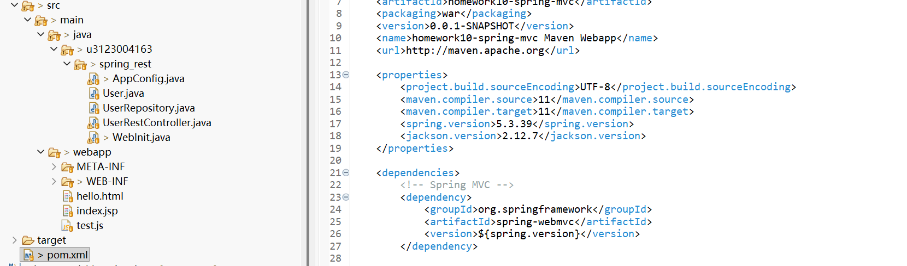
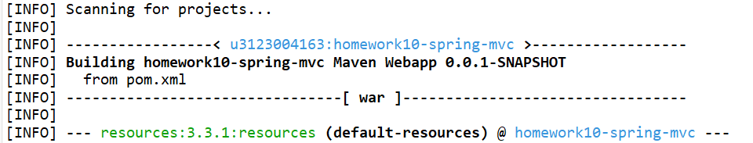
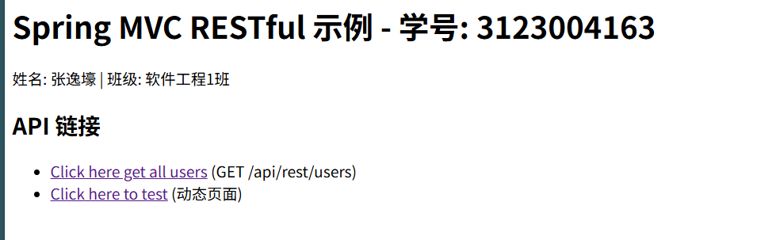
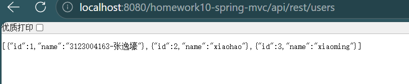
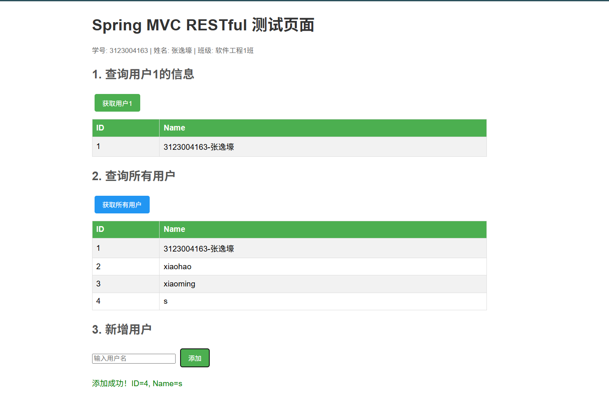

# 第十次作业：Maven + Spring MVC RESTful

## 基本信息

| 项目 | 内容 |
|------|------|
| 学号 | 3123004163 |
| 姓名 | 张逸壕 |
| 班级 | 软件工程1班 |
| 作业名称 | SOA 第十次作业 — Maven + Spring MVC RESTful |
| Eclipse 项目 | `homework10-spring-mvc` |
| 源码目录 | `eclipse-workspace/homework10-spring-mvc/src/main/java/u3123004163/spring_rest/` |

---

## 一、作业要求

1. 学习在 Eclipse 中建立 Maven 项目，学习 Spring MVC 概念
2. 创建 Maven Web 项目（`maven-archetype-webapp`）
3. 增加 Spring MVC 依赖（pom.xml）
4. 创建 Spring 上下文配置类（`AppConfig`）
5. 创建 Spring Web 初始化类（`WebInit`）
6. 增加 `User` 类（JavaBean）
7. 增加 `UserRepository` 仓库类（增删改查）
8. 增加 `UserRestController` 控制器（RESTful API）
9. 增加前端页面（`index.jsp`、`hello.html`、`test.js`）
10. 截图撰写文档，文件名为 `作业10.md`

---

## 二、Maven 与 Spring MVC 知识总结

### 2.1 Maven 简介

Maven 是 Java 项目的构建和依赖管理工具。核心概念：

| 概念 | 说明 |
|------|------|
| POM | Project Object Model，项目对象模型，即 `pom.xml` 文件 |
| GroupId | 组织/公司标识，本项目使用学号 `u3123004163` |
| ArtifactId | 项目/组件标识，本项目为 `homework10-spring-mvc` |
| Version | 版本号，如 `0.0.1-SNAPSHOT` |
| Dependency | 依赖声明，Maven 自动从中央仓库下载 |
| Archetype | 项目模板，本项目使用 `maven-archetype-webapp` |

### 2.2 Spring MVC 前端控制器模式

```
浏览器 → DispatcherServlet（前端控制器）→ HandlerMapping → Controller → 返回 JSON
```

**核心流程：**

1. 浏览器发送 HTTP 请求到 Tomcat
2. Tomcat 根据路径 `/api/*` 将请求转发给 `DispatcherServlet`
3. `DispatcherServlet` 查找 `@RequestMapping` 匹配的控制器方法
4. 控制器方法执行业务逻辑并返回 Java 对象
5. `@ResponseBody` + Jackson 将 Java 对象自动转为 JSON 放入 Response Body

### 2.3 关键注解说明

| 注解 | 含义 |
|------|------|
| `@Configuration` | 声明该类是 Spring 配置类 |
| `@ComponentScan` | 指定 Spring 自动扫描的包路径 |
| `@Bean` | 声明该方法返回的对象由 Spring 容器管理 |
| `@Repository` | 声明该类是数据仓库（DAO），Spring 自动扫描注册 |
| `@RestController` | = `@Controller` + `@ResponseBody`，RESTful 控制器 |
| `@RequestMapping` | 将 HTTP 请求 URL 映射到控制器方法 |
| `@Autowired` | Spring 自动注入依赖 |
| `@PathVariable` | 从 URL 路径中提取参数 |
| `@RequestBody` | 将 HTTP 请求体中的 JSON 转为 Java 对象 |
| `@ResponseStatus` | 指定 HTTP 响应状态码 |

---

## 三、项目结构

```
homework10-spring-mvc/
├── pom.xml                          # Maven 项目配置 + 依赖声明
└── src/main/
    ├── java/u3123004163/spring_rest/
    │   ├── AppConfig.java           # Spring 上下文配置类
    │   ├── WebInit.java             # Spring Web 初始化类（替代 web.xml）
    │   ├── User.java                # 用户实体类（JavaBean）
    │   ├── UserRepository.java      # 用户仓库类（内存增删改查）
    │   └── UserRestController.java  # REST 控制器
    └── webapp/
        ├── index.jsp                # 首页（API 链接）
        ├── hello.html               # 动态测试页面
        ├── test.js                  # JavaScript（fetch 调用 REST API）
        ├── META-INF/MANIFEST.MF
        └── WEB-INF/web.xml
```

---

## 四、各文件实现说明

### 4.1 pom.xml — Maven 项目配置

- **groupId**：`u3123004163`（学号前加字母 u）
- **artifactId**：`homework10-spring-mvc`
- **packaging**：`war`（Web 应用）
- **依赖**：
  - `spring-webmvc`：Spring MVC 框架
  - `jackson-databind`：Java ↔ JSON 转换
  - `javax.servlet-api`：Servlet API（provided，Tomcat 提供）
  - `javax.servlet.jsp-api`：JSP API（provided）

### 4.2 AppConfig.java — Spring 上下文配置类

- `@Configuration`：声明配置类
- `@ComponentScan(basePackages = {"u3123004163.spring_rest"})`：扫描自己的包，否则 Spring 无法发现 Bean
- `@Bean beanNameViewResolver()`：配置视图解析器，用于处理 JSON 返回

### 4.3 WebInit.java — Spring Web 初始化类

- 实现 `WebApplicationInitializer` 接口，**替代传统 web.xml 配置**
- 在 `onStartup()` 中：
  1. 创建 `AnnotationConfigWebApplicationContext`，注册 `AppConfig.class`
  2. 创建 `DispatcherServlet`，注册到 Servlet 容器
  3. 配置 URL 映射：`/api/*`（拦截所有 `/api/` 开头的请求）

### 4.4 User.java — 用户实体类

- 属性：`id`（Long）、`name`（String）
- 提供 Getter/Setter 和无参构造函数
- Spring + Jackson 会自动将 User 对象序列化为 JSON

### 4.5 UserRepository.java — 用户仓库类

- `@Repository` 注解标记，Spring 自动扫描注册
- 使用 `ConcurrentHashMap` 存储用户数据（线程安全，内存模拟）
- 预置数据：`3123004163-张逸壕`、`xiaohao`、`xiaoming`
- 操作：`findAll()`、`findById()`、`save()`、`update()`、`delete()`

### 4.6 UserRestController.java — REST 控制器

- `@RestController` = `@Controller` + `@ResponseBody`
- `@RequestMapping("/rest")`：类级别映射
- 由于 `WebInit` 中配置了 `/api/*`，完整 URL 前缀为 `/api/rest/`

| HTTP 方法 | URL | 方法 | 功能 |
|-----------|-----|------|------|
| GET | `/api/rest/users` | `list()` | 获取所有用户 |
| GET | `/api/rest/users/{id}` | `get()` | 根据 ID 获取用户 |
| POST | `/api/rest/users` | `create()` | 新增用户 |
| PUT | `/api/rest/users/{id}` | `update()` | 修改用户 |
| DELETE | `/api/rest/users/{id}` | `delete()` | 删除用户 |

- `@Autowired` 自动注入 `UserRepository`
- 404 时抛出 `UserNotFoundException`

### 4.7 index.jsp — 首页

- 显示学号姓名信息
- 提供 API 直接访问链接和动态测试页面链接

### 4.8 hello.html + test.js — 动态前端页面

- 使用 JavaScript `fetch()` 方法（异步处理技术）调用 REST API
- `getUser1()`：访问 `api/rest/users/1`，动态创建表格展示用户1信息
- `getAllUsers()`：访问 `api/rest/users`，展示所有用户列表
- `addUser()`：POST 新增用户
- 动态操控 HTML DOM，这种方式称为单页面应用技术（SPA）

---

## 五、与 Homework9 的区别

| 项目 | Homework9（JSP） | Homework10（Spring MVC REST） |
|------|------------------|-------------------------------|
| 配置方式 | `web.xml` | `WebInit.java`（编程式配置） |
| 控制层 | JSP 内嵌 Java | `@RestController` |
| 数据返回 | 服务端渲染 HTML | JSON（RESTful API） |
| 前端 | JSP 页面 | HTML + JavaScript（fetch） |
| URL 映射 | `@WebServlet` | `@RequestMapping` |
| 依赖管理 | 无（手动加 JAR） | Maven（pom.xml） |

---

## 六、运行说明

### 6.1 Eclipse 中运行

1. 将项目导入 Eclipse 工作区（`eclipse-workspace`）
2. 右键项目 → `Run As` → `Maven install`（下载依赖）
3. 右键项目 → `Run As` → `Run on Server`（选择 Tomcat 9）
4. 浏览器访问 `http://localhost:8080/homework10-spring-mvc/`

### 6.2 测试 API

| 操作 | URL | 方法 |
|------|-----|------|
| 首页 | `http://localhost:8080/homework10-spring-mvc/` | GET |
| 所有用户 | `http://localhost:8080/homework10-spring-mvc/api/rest/users` | GET |
| 用户1 | `http://localhost:8080/homework10-spring-mvc/api/rest/users/1` | GET |
| 动态页面 | `http://localhost:8080/homework10-spring-mvc/hello.html` | GET |

---

## 七、运行截图

### 截图1：项目创建成功



### 截图2：Maven 依赖加载



### 截图3：访问首页



### 截图4：API 返回 JSON



### 截图5：动态页面测试



---
