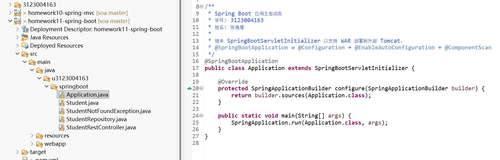
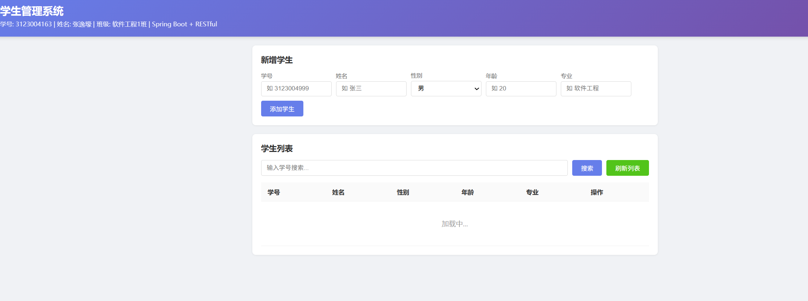
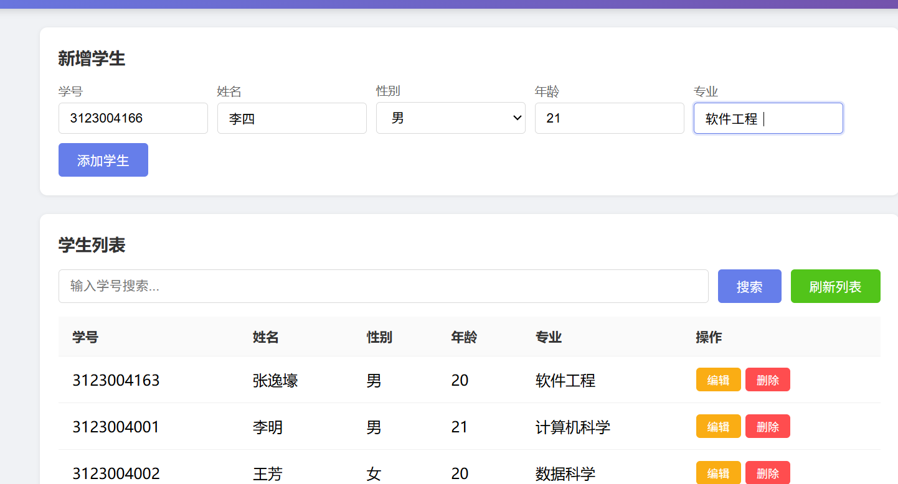
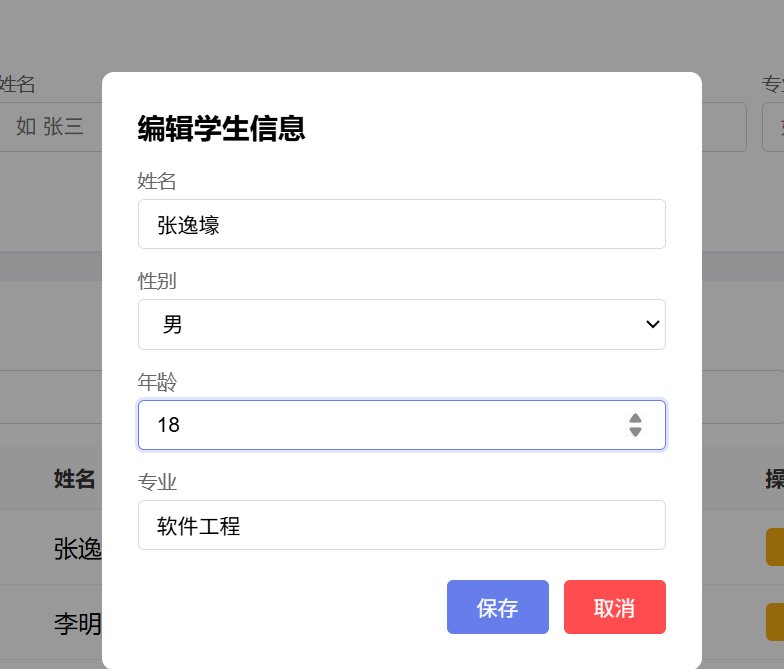
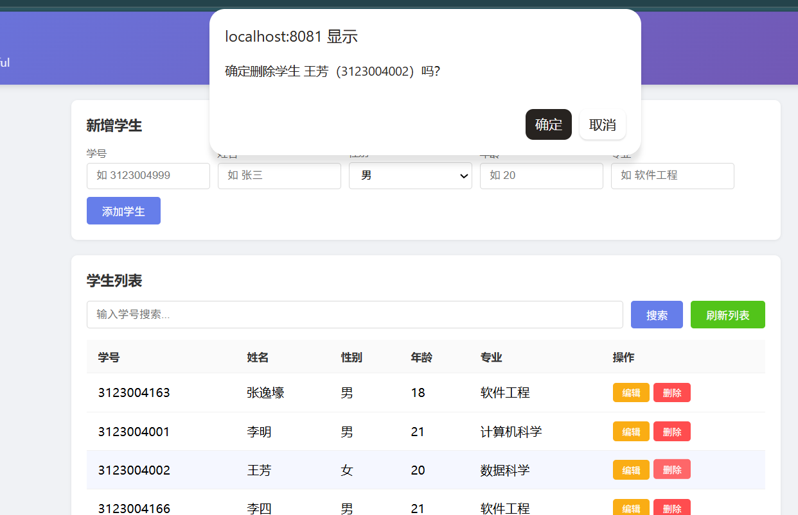
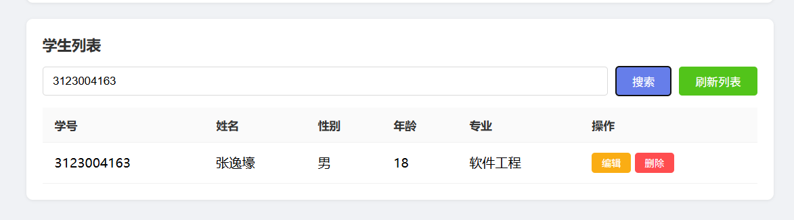

# 第十一次作业：Spring Boot + RESTful 学生管理系统

## 基本信息

| 项目 | 内容 |
|------|------|
| 学号 | 3123004163 |
| 姓名 | 张逸壕 |
| 班级 | 软件工程1班 |
| 作业名称 | SOA 第十一次作业 — Spring Boot + RESTful 学生管理系统 |
| Eclipse 项目 | `homework11-spring-boot` |
| 源码目录 | `eclipse-workspace/homework11-spring-boot/src/main/java/u3123004163/springboot/` |

---

## 一、作业要求

1. 使用 Spring RESTful + Spring Boot 完成学生管理系统
2. 有简单的 UI 界面，可以实现学生信息的增加、删除、修改和查询
3. 使用 Web 前端技术开发（HTML + JavaScript）
4. 使用文件系统保存数据（JSON 文件持久化）
5. 将上述内容截图、撰写文档，文件名为 `作业11.md`

---

## 二、Spring Boot 知识总结

### 2.1 Spring Boot 简介

Spring Boot 是 Spring 框架的快速开发脚手架，核心特性：

| 特性 | 说明 |
|------|------|
| 自动配置 | 根据依赖自动配置 Spring 应用，无需手动写 XML |
| Starter 依赖 | 一键引入相关依赖，如 `spring-boot-starter-web` |
| 内嵌服务器 | 内嵌 Tomcat，无需部署 WAR 即可运行 |
| `@SpringBootApplication` | = `@Configuration` + `@EnableAutoConfiguration` + `@ComponentScan` |

### 2.2 Spring Boot 与 Spring MVC 的区别

| 项目 | Spring MVC（作业10） | Spring Boot（作业11） |
|------|---------------------|----------------------|
| 配置方式 | 手动写 `AppConfig` + `WebInit` | `@SpringBootApplication` 自动配置 |
| 依赖管理 | 手动声明各依赖版本 | Starter 自动管理版本 |
| 服务器 | 外部 Tomcat 部署 WAR | 内嵌 Tomcat，直接运行 |
| 启动方式 | `Run on Server` | `main()` 方法 / `Run on Server` |
| 项目初始化 | 手动创建 | Spring Boot Parent POM |

### 2.3 关键注解说明

| 注解 | 含义 |
|------|------|
| `@SpringBootApplication` | 组合注解，开启自动配置 + 组件扫描 |
| `@RestController` | = `@Controller` + `@ResponseBody`，RESTful 控制器 |
| `@RequestMapping` | 将 HTTP 请求 URL 映射到控制器方法 |
| `@Autowired` | Spring 自动注入依赖 |
| `@PathVariable` | 从 URL 路径中提取参数 |
| `@RequestBody` | 将 HTTP 请求体中的 JSON 转为 Java 对象 |
| `@ResponseStatus` | 指定 HTTP 响应状态码 |
| `@Repository` | 声明数据仓库 Bean |
| `@Value` | 注入配置文件中的属性值 |

---

## 三、项目结构

```
homework11-spring-boot/
├── pom.xml                              # Maven 项目配置 + Spring Boot Parent
└── src/main/
    ├── java/u3123004163/springboot/
    │   ├── Application.java             # Spring Boot 主启动类
    │   ├── Student.java                 # 学生实体类（JavaBean）
    │   ├── StudentRepository.java       # 学生仓库类（JSON 文件持久化）
    │   ├── StudentRestController.java   # REST 控制器（增删改查 API）
    │   └── StudentNotFoundException.java# 学生未找到异常（404）
    ├── resources/
    │   └── application.properties       # Spring Boot 配置文件
    └── webapp/
        ├── index.html                   # 学生管理前端 UI（增删改查界面）
        ├── META-INF/MANIFEST.MF
        └── WEB-INF/web.xml
```

---

## 四、各文件实现说明

### 4.1 pom.xml — Maven 项目配置

- **parent**：`spring-boot-starter-parent` 2.7.18（Spring Boot 父 POM，自动管理版本）
- **groupId**：`u3123004163`
- **artifactId**：`homework11-spring-boot`
- **packaging**：`war`（支持部署到外部 Tomcat）
- **依赖**：
  - `spring-boot-starter-web`：包含 Spring MVC + 内嵌 Tomcat + Jackson
  - `javax.servlet-api`：Servlet API（provided）
  - `javax.servlet.jsp-api`：JSP API（provided）
  - `spring-boot-devtools`：热部署（可选）

### 4.2 Application.java — Spring Boot 主启动类

- `@SpringBootApplication`：开启自动配置和组件扫描
- 继承 `SpringBootServletInitializer`：支持 WAR 部署到外部 Tomcat
- `main()` 方法：`SpringApplication.run()` 直接启动内嵌 Tomcat

### 4.3 Student.java — 学生实体类

- 属性：`studentId`（学号，String）、`name`（姓名）、`gender`（性别）、`age`（年龄）、`major`（专业）
- 提供 Getter/Setter 和无参构造函数
- Spring Boot + Jackson 自动将 Student 对象序列化为 JSON

### 4.4 StudentRepository.java — 学生仓库类（文件持久化）

- `@Repository` 注解标记
- 使用 `LinkedHashMap` 内存缓存，key 为 `studentId`
- 使用 Jackson `ObjectMapper` 将数据读写到 `students.json` 文件
- 每次增删改操作后自动调用 `persistData()` 保存到文件
- 应用启动时自动从文件 `loadData()` 加载数据
- 预置数据：`3123004163-张逸壕`、`3123004001-李明`、`3123004002-王芳`

### 4.5 StudentRestController.java — REST 控制器

- `@RestController` + `@RequestMapping("/api/students")`
- 完整 RESTful CRUD 操作：

| HTTP 方法 | URL | 方法 | 功能 |
|-----------|-----|------|------|
| GET | `/api/students` | `list()` | 获取所有学生 |
| GET | `/api/students/{studentId}` | `get()` | 根据学号获取学生 |
| POST | `/api/students` | `create()` | 新增学生 |
| PUT | `/api/students/{studentId}` | `update()` | 修改学生 |
| DELETE | `/api/students/{studentId}` | `delete()` | 删除学生 |

### 4.6 StudentNotFoundException.java — 异常类

- `@ResponseStatus(HttpStatus.NOT_FOUND)`：Spring 自动返回 404

### 4.7 application.properties — 配置文件

- `server.port=8080`：服务器端口
- `app.data.file=students.json`：数据文件路径

### 4.8 index.html — 前端管理界面

- 使用 HTML + CSS + JavaScript 开发
- 使用 `fetch()` 异步调用 REST API
- 功能：
  - **新增**：填写学号、姓名、性别、年龄、专业，点击"添加学生"按钮
  - **查询**：输入学号搜索，或点击"刷新列表"显示所有学生
  - **修改**：点击"编辑"按钮弹出模态框，修改后保存
  - **删除**：点击"删除"按钮，确认后删除
- 界面采用现代化卡片式设计，表格展示学生列表

---

## 五、与作业10 的区别

| 项目 | 作业10（Spring MVC） | 作业11（Spring Boot） |
|------|---------------------|----------------------|
| 配置方式 | 手动 `AppConfig` + `WebInit` | `@SpringBootApplication` 自动配置 |
| 启动方式 | 仅能部署到外部 Tomcat | 可内嵌 Tomcat 直接运行，也可部署到外部 |
| 依赖管理 | 手动声明版本号 | `spring-boot-starter-parent` 管理版本 |
| 数据实体 | `User`（id + name） | `Student`（学号 + 姓名 + 性别 + 年龄 + 专业） |
| 数据存储 | `ConcurrentHashMap`（纯内存） | JSON 文件持久化（内存 + 文件读写） |
| 前端页面 | 简单测试页面 | 完整管理界面（增删改查 + 搜索 + 模态框） |
| API 路径 | `/api/rest/users` | `/api/students` |

---

## 六、运行说明

### 6.1 Eclipse 中运行

1. 将项目导入 Eclipse 工作区（`Import` → `Maven` → `Existing Maven Projects`）
2. 右键项目 → `Run As` → `Maven install`（下载依赖）
3. 右键项目 → `Run As` → `Run on Server`（选择 Tomcat 9）
4. 浏览器访问 `http://localhost:8080/homework11-spring-boot/`

### 6.2 测试 API

| 操作 | URL | 方法 |
|------|-----|------|
| 管理界面 | `http://localhost:8080/homework11-spring-boot/` | GET |
| 所有学生 | `http://localhost:8080/homework11-spring-boot/api/students` | GET |
| 指定学生 | `http://localhost:8080/homework11-spring-boot/api/students/3123004163` | GET |

---

## 七、运行截图

（以下截图需要在 Eclipse 中实际运行后补充）

### 截图1：项目创建成功



### 截图2：管理界面首页



### 截图3：新增学生



### 截图4：编辑学生



### 截图5：删除学生



### 截图6：搜索学生



---

## 八、AI 辅助说明

本项目使用了 AI 工具辅助开发：

- **辅助内容**：
  1. 项目结构设计和依赖配置
  2. Spring Boot 主启动类和配置文件的编写
  3. StudentRepository 文件持久化逻辑的实现
  4. RESTful API 控制器的设计
  5. 前端管理界面（HTML + CSS + JavaScript）的开发
  6. 文档的撰写
- **AI 提示示例**：
  - "创建 Spring Boot 学生管理系统，要有增删改查功能"
  - "使用 JSON 文件做数据持久化"
  - "前端界面要好看，支持新增、编辑、删除、搜索"

所有 AI 生成的代码均经过理解和验证，确保符合项目需求。
