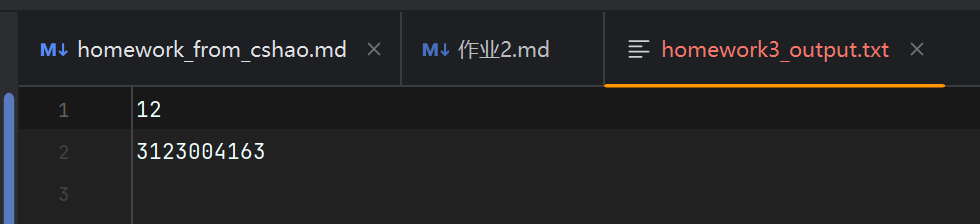

# 第三次作业：Java 字节流与流式输出

| 学号 | 姓名 | 班级 |
|:---:|:---:|:---:|
| 3123004163 | 张逸壕 | 软件工程1班 |

## 一、功能说明

程序类 `homework3.Homework3`（`eclipse-workspace/3123004163/src/homework3/Homework3.java`）将 **`int`** 与 **学号** 以 **UTF-8 文本** 写入项目目录下的 **`homework3_output.txt`**（第一行为整数，第二行为学号）。使用 **`FileOutputStream` → `BufferedOutputStream`**（以 `OutputStream` 多态引用），`try-with-resources` 关闭流。

扩展类 `homework3.Homework3StreamChain`（同级目录下）演示更复杂的流级联：**`DataOutputStream` → `BufferedOutputStream` → `FileOutputStream`**，将同一组数据以二进制形式写入 **`homework3_binary.dat`**，作为对“多级流包装”的练习。

## 二、实现要点

- 将 `int`、学号格式化为多行文本，再 `getBytes(StandardCharsets.UTF_8)` 后 **`BufferedOutputStream.write(byte[])`** 写出。
- **`OutputStream`** 抽象引用具体文件流与缓冲流，体现装饰器式包装与多态。
- （扩展）在 **`BufferedOutputStream`** 外包一层 **`DataOutputStream`**，使用 **`writeInt`**、**`writeUTF`** 写出二进制格式，与文本 `.txt` 输出对照理解不同流职责。

## 三、运行结果截图

以下为生成的 **`homework3_output.txt`** 内容示意（或运行/文件查看截图）。

