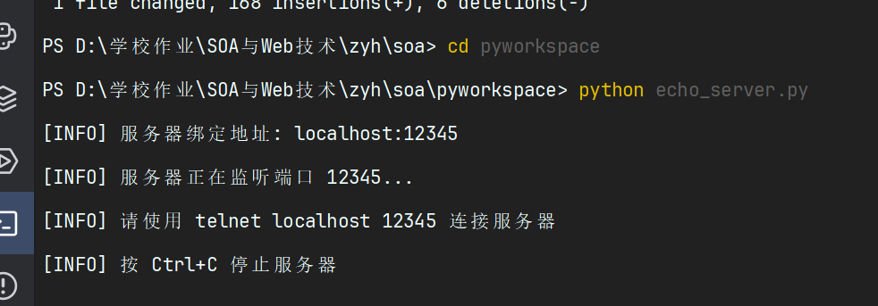
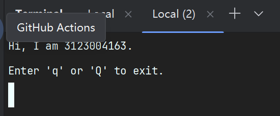
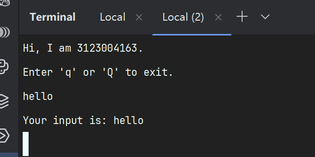
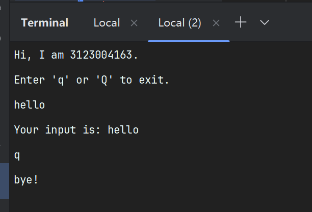

# 作业5：简单的应答服务器

## 基本信息
- **学号**：3123004163
- **姓名**：张逸壕
- **班级**：软件工程1班
- **作业名称**：编写简单的应答服务器
- **实现语言**：Python 3

## 作业要求

1. 编写一个应答服务器，可以实现用户输入应答功能
2. 需要有自己的个人信息，比如学号信息
3. 用户输入 q 或 Q 退出程序
4. 用户输入其它信息，则返回用户输入
5. 使用telnet作为客户端与服务器通信

## 实现思路

### 技术方案
- 使用Python的 `socket` 模块实现TCP服务器
- 端口号：12345（与作业要求一致）
- 采用同步方式处理客户端连接
- 完善的异常处理机制

### 核心功能
1. **服务器启动**：创建ServerSocket，绑定端口12345，开始监听
2. **客户端连接**：接受telnet客户端连接
3. **欢迎信息**：显示学号信息（3123004163）和使用提示
4. **应答逻辑**：
   - 接收用户输入
   - 判断是否为 'q' 或 'Q'
   - 如果是，返回"bye!"并断开连接
   - 否则，返回"Your input is: [用户输入]"
5. **异常处理**：处理客户端异常断开、端口占用等情况
6. **资源清理**：确保socket正确关闭

## 源代码

### echo_server.py

## 使用说明

### 环境要求
- Python 3.6+
- Windows操作系统
- 已启用Telnet客户端功能

### 启用Telnet客户端（如果未启用）
1. 打开"控制面板" → "程序" → "启用或关闭Windows功能"
2. 勾选"Telnet客户端"
3. 点击"确定"，等待安装完成

### 运行步骤

#### 步骤1：启动服务器
打开命令行，进入程序所在目录，运行：
```bash
cd pyworkspace
python echo_server.py
```

服务器启动后会显示：
```
[INFO] 服务器绑定地址: localhost:12345
[INFO] 服务器正在监听端口 12345...
[INFO] 请使用 telnet localhost 12345 连接服务器
[INFO] 按 Ctrl+C 停止服务器
```

#### 步骤2：连接服务器
打开新的命令提示符窗口，运行：
```bash
telnet localhost 12345
```

#### 步骤3：测试功能

**测试1：正常输入**
```
连接后显示：
Hi, I am 3123004163.
Enter 'q' or 'Q' to exit.

输入：hello
返回：Your input is: hello
```

**测试2：输入q退出**
```
输入：q
返回：bye!
连接断开
```

**测试3：输入Q退出**
```
输入：Q
返回：bye!
连接断开
```

### 停止服务器
在服务器窗口按 `Ctrl+C`

## 测试截图

### 截图1：服务器启动


### 截图2：Telnet连接并输入消息


### 截图3：输入q退出




## 代码说明

### 关键函数

#### `handle_client(client_socket, client_address)`
- **功能**：处理单个客户端连接的所有通信
- **参数**：
  - `client_socket`：客户端的socket对象
  - `client_address`：客户端的地址信息
- **返回值**：无

#### `main()`
- **功能**：服务器主函数，负责创建和运行服务器
- **实现**：
  1. 创建TCP socket
  2. 绑定地址和端口
  3. 开始监听
  4. 循环接受客户端连接
  5. 调用handle_client处理每个客户端

### 异常处理

程序包含以下异常处理：
1. **ConnectionResetError**：客户端异常断开连接
2. **KeyboardInterrupt**：用户按Ctrl+C停止服务器
3. **OSError**：端口被占用等系统错误
4. **通用Exception**：其他未预期的错误

### 资源管理

使用 `try-finally` 确保：
- 客户端socket正确关闭
- 服务器socket正确关闭
- 避免资源泄漏
