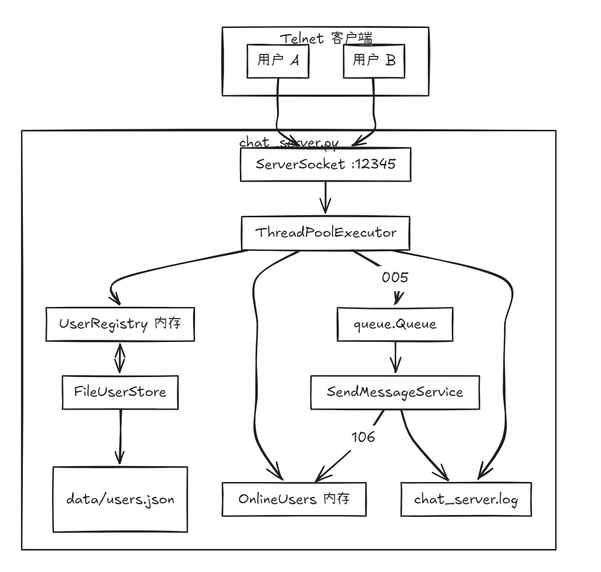
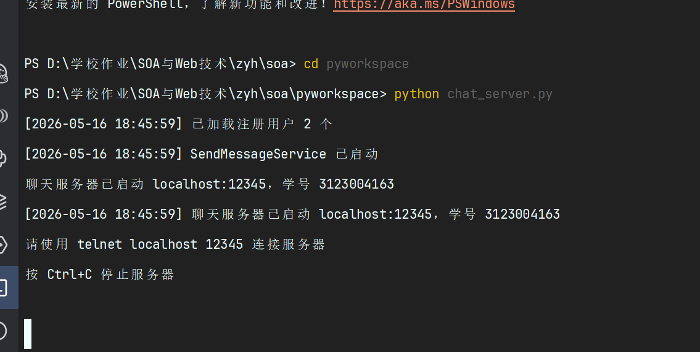
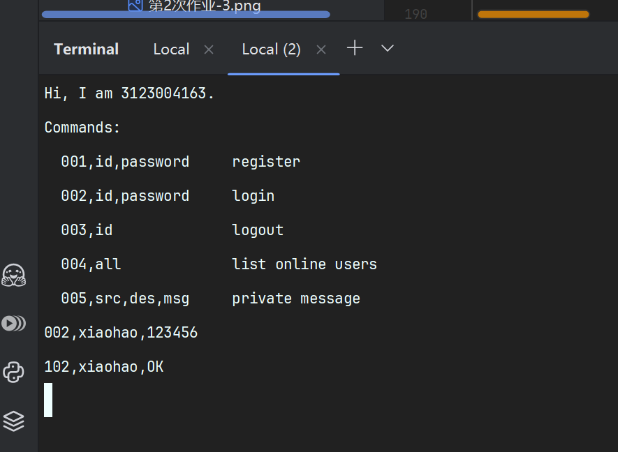
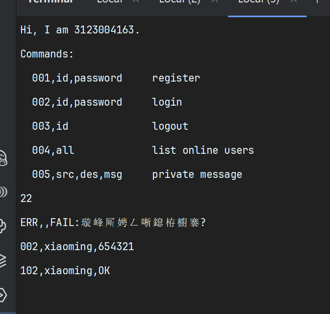
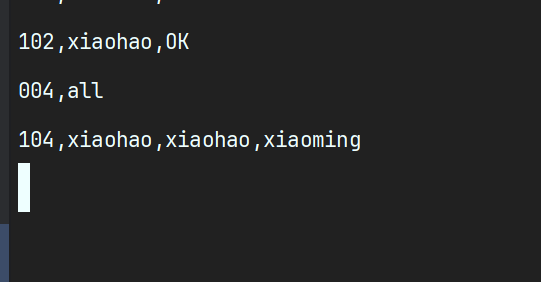
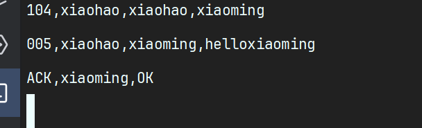
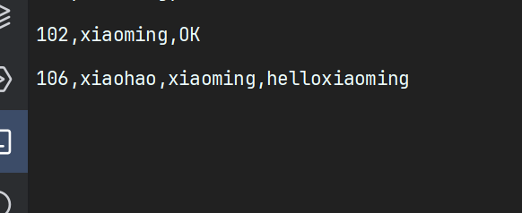
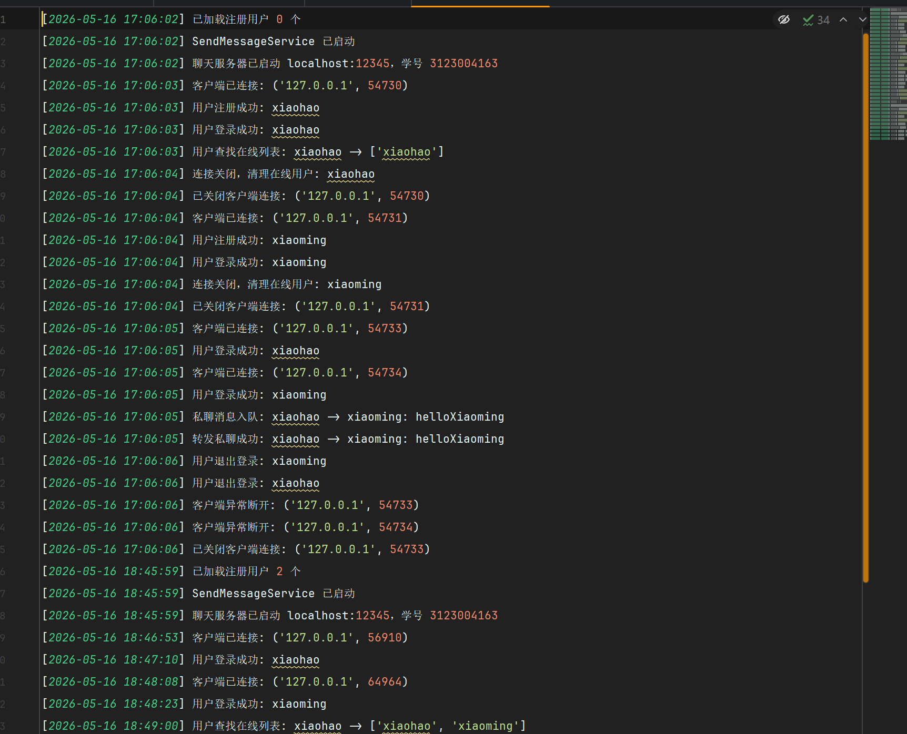

# 作业6：多用户聊天服务器

## 基本信息

- **学号**：3123004163
- **姓名**：张逸壕
- **班级**：软件工程1班
- **作业名称**：SOA 第六次作业 — 多用户聊天服务器
- **实现语言**：Python 3.6+
- **主程序**：`pyworkspace/chat_server.py`
- **持久化模块**：`pyworkspace/user_store.py`
- **前置程序**：`pyworkspace/echo_server.py`（作业5，未修改）

---

## 一、作业要求

1. 将应答服务器改造成聊天服务器，使多个用户之间可以互发消息。
2. 使用 Git 管理所有内容。
3. 撰写 Markdown 实现说明文档（本文件）。
4. 修改前面作业中出现的错误或不足之处。

### 功能要求

| 功能 | 命令码 | 实现情况 |
|------|--------|----------|
| 个人信息（学号） | 欢迎语 | 已实现 |
| 用户注册 | 001 | 已实现 |
| 用户登录 | 002 | 已实现 |
| 用户查找 | 004 | 返回在线用户列表 |
| 私聊 | 005 / 106 | 已实现（消息队列转发） |
| 退出登录 | 003 | 已实现 |

客户端使用 **telnet** 连接 `localhost:12345`，可开多个 cmd 窗口模拟多用户。

---

## 二、系统架构




---

## 三、通信协议设计

### 3.1 通用格式

```
命令码,数据部分
```

- 命令码为 3 位数字；字段用英文逗号分隔。
- 用户名 `id` 不得包含空格和逗号；消息内容亦不应包含逗号。

### 3.2 客户端 → 服务器

| 命令码 | 含义 | 数据格式 | 示例 |
|--------|------|----------|------|
| 001 | 用户注册 | `id,password` | `001,xiaohao,123456` |
| 002 | 用户登录 | `id,password` | `002,xiaohao,123456` |
| 003 | 用户退出 | `id` | `003,xiaohao` |
| 004 | 查找用户 | `all` | `004,all` |
| 005 | 发送私聊 | `srcId,desId,msg` | `005,xiaohao,xiaoming,你好` |

### 3.3 服务器 → 客户端

| 命令码 | 含义 | 数据格式 | 示例 |
|--------|------|----------|------|
| 101 | 注册结果 | `id,result` | `101,xiaohao,OK` |
| 102 | 登录结果 | `id,result` | `102,xiaohao,OK` |
| 103 | 退出结果 | `id` | `103,xiaohao` |
| 104 | 查找结果 | `requestId,id1,id2,...` | `104,xiaohao,xiaohao,xiaoming` |
| 106 | 私聊转发 | `srcId,desId,msg` | `106,xiaohao,xiaoming,你好` |
| ACK | 私聊已入队 | `desId,OK` | `ACK,xiaoming,OK` |
| ERR | 错误提示 | 文本说明 | `ERR,xiaoming,FAIL:目标用户不在线` |

### 3.4 私聊转发流程（生产者/消费者）

1. 用户 A 发送：`005,xiaohao,xiaoming,你好`
2. `ClientHandler` 校验 A 已登录且 `srcId` 与当前用户一致。
3. 将 `(srcId, desId, msg)` 放入 `queue.Queue`（生产者）。
4. `SendMessageService` 线程取出消息（消费者）。
5. 查在线映射，若目标在线则发送 `106,xiaohao,xiaoming,你好`；否则向发送方返回 `ERR,...目标用户不在线`。

---

## 四、多线程与持久化设计

### 4.1 多线程（对照课件 Java）

| 课件（Java） | 本实现（Python） |
|--------------|------------------|
| `ClientService implements Runnable` | `handle_client_connection` + 线程池 |
| `Executors.newFixedThreadPool(30)` | `ThreadPoolExecutor(max_workers=30)` |
| `sendMsgService` | `SendMessageService(threading.Thread)` |
| `Map<userId, Socket>` | `OnlineUsers` + `threading.Lock` |

### 4.2 启动顺序

1. `FileUserStore` 加载 `data/users.json` 到 `UserRegistry`
2. 创建 `queue.Queue` 与 `OnlineUsers`
3. **先**启动 `SendMessageService` 线程
4. 绑定端口并开始 `accept`，每连接 `executor.submit(...)`

### 4.3 用户持久化（选作降级方案）

课件选作要求可将数据保存到数据库。本作业采用 **本地 JSON 文件**，并通过 `UserStore` 接口保留升级路径：

```
UserStore（Protocol）
    ├── FileUserStore      ← 本作业实现
    └── DbUserStore        ← 预留，日后可替换
```

| 数据 | 存放位置 | 说明 |
|------|----------|------|
| 注册账号 | 内存 + `data/users.json` | 重启后 `load_all()` 恢复 |
| 在线用户 | 仅内存 `OnlineUsers` | 进程结束即清空 |
| 关键操作 | `chat_server.log` | 追加写入 |

---

## 五、关键代码说明

### 5.1 线程池 accept 循环

主线程只负责 `accept()`，每个客户端由线程池中的 `handle_client_connection` 处理，支持多用户同时在线。

### 5.2 SendMessageService（消息消费线程）

独立守护线程从 `msg_queue.get()` 取消息，通过 `OnlineUsers.send_to()` 向目标 socket 发送 `106,...` 协议行；目标离线时向源用户返回 `ERR` 提示。

### 5.3 OnlineUsers（id ↔ socket 映射）

- `bind(id, sock)`：登录成功后绑定
- `get_socket(id)` / `get_id(sock)`：查询与清理
- `unbind(id)`：退出登录时移除
- 客户端异常断开时 `remove_by_socket(sock)` 自动清理

### 5.4 命令分发

`handle_command()` 根据命令码调用 `do_register`、`do_login`、`do_logout`、`do_search`、`do_send_message`；未登录时仅允许 `001`、`002`。

---

## 六、运行与测试

### 6.1 环境要求

- Python 3.6+
- Windows 已启用 Telnet 客户端
- **不要**同时运行 `echo_server.py` 与 `chat_server.py`（同端口 12345）

### 6.2 启动服务器

```powershell
cd pyworkspace
python chat_server.py
```

成功标志：控制台显示 `SendMessageService 已启动`、`聊天服务器已启动 localhost:12345，学号 3123004163`。

### 6.3 多 telnet 测试步骤

**窗口 B（xiaohao）：**

```text
telnet localhost 12345
001,xiaohao,123456
002,xiaohao,123456
004,all
005,xiaohao,xiaoming,helloXiaoming
003,xiaohao
```

**窗口 C（xiaoming）：**

```text
telnet localhost 12345
001,xiaoming,654321
002,xiaoming,654321
```

预期结果：

| 步骤 | 预期响应 |
|------|----------|
| 001 | `101,xiaohao,OK` |
| 002 | `102,xiaohao,OK` |
| 004 | `104,xiaohao,xiaohao,xiaoming` |
| 005 | B 收到 `ACK,xiaoming,OK`；C 自动收到 `106,xiaohao,xiaoming,helloXiaoming` |
| 003 | `103,xiaohao` |

### 6.4 测试截图

#### 截图1：服务器启动



#### 截图2：用户1（xiaohao）注册登录



#### 截图3：用户2（xiaoming）注册登录



#### 截图4：查找在线用户



#### 截图5：私聊发送（xiaohao → xiaoming）



#### 截图6：私聊接收（xiaoming 收到 106）



#### 截图7：退出登录


#### 截图8：服务器日志



---

## 七、文件结构

```
soa/
├── 作业6.md
├── image/
│   ├── 第6次作业-服务器启动.png
│   ├── 第6次作业-用户1登录.png
│   ├── 第6次作业-用户2登录.png
│   ├── 第6次作业-查看所有用户.png
│   ├── 第6次作业-私聊发送.png
│   ├── 第6次作业-私聊接收.png
│   ├── 第6次作业-退出登录.png
│   └── 第6次作业-服务日志.png
└── pyworkspace/
    ├── echo_server.py          # 作业5（未修改）
    ├── chat_server.py          # 作业6 主程序
    ├── user_store.py           # 用户持久化
    ├── chat_server.log         # 运行日志
    └── data/
        └── users.json          # 注册用户
```

---
