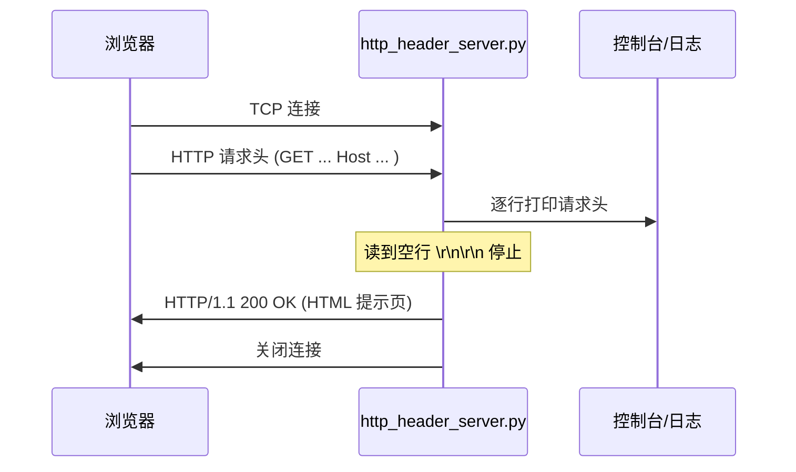
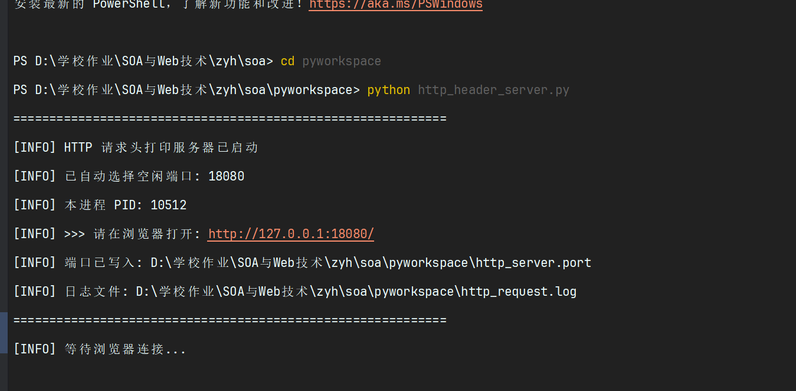
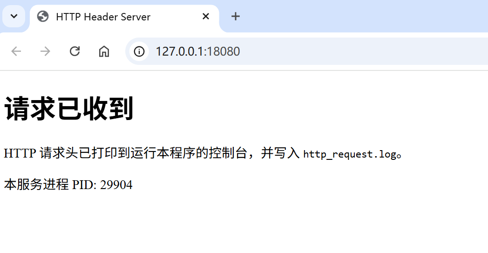
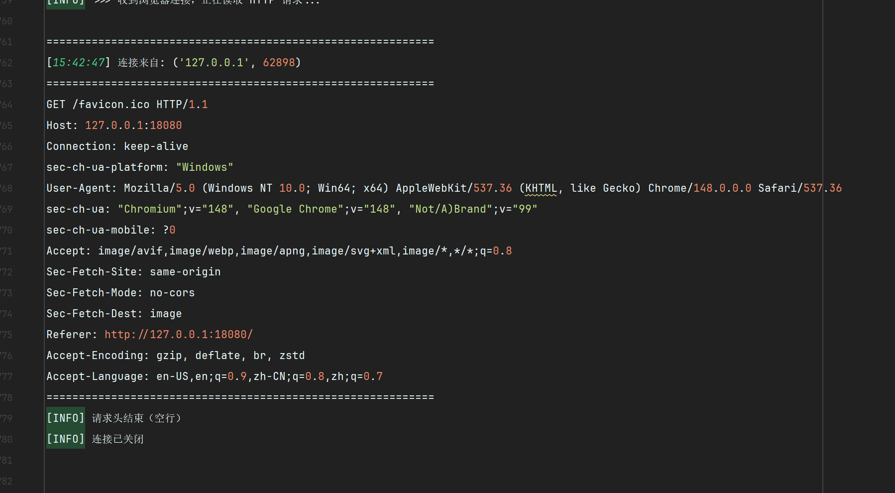
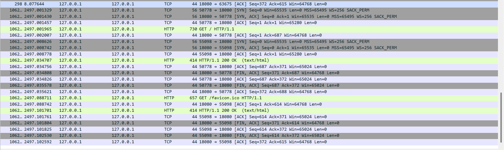

# 作业7：理解 HTTP 协议（网络编程）

## 基本信息
- **学号**：3123004163
- **姓名**：张逸壕
- **班级**：软件工程1班
- **作业名称**：SOA 第七次作业 — 理解 HTTP 协议（网络编程）
- **实现语言**：Python 3.6+
- **主程序**：`pyworkspace/http_header_server.py`

---

## 一、作业要求

1. 自学 HTTP 协议
2. 使用 **ServerSocket** 编程，实现程序**显示浏览器发来的 HTTP 命令内容**
3. 使用 **Wireshark** 或 **Fiddler** 查看 HTTP 各种命令的数据格式
4. 撰写 Markdown 文档，文件名为 **`作业7.md`**
5. 修改前面作业中的错误或不足

---

## 二、HTTP 协议自学小结

### 2.1 HTTP 协议概述

HTTP（HyperText Transfer Protocol，超文本传输协议）是应用层协议，用于在 Web 浏览器和服务器之间传输数据。它基于 TCP/IP 协议栈，采用请求-响应模式。

**主要特点：**
- 无状态协议：每次请求独立，不保留之前的状态
- 基于文本：请求和响应都是可读的文本格式
- 客户端-服务器模式：浏览器作为客户端，Web 服务器提供服务
- 支持多种方法：GET、POST、PUT、DELETE 等

### 2.2 HTTP 请求报文结构

HTTP 请求报文由以下部分组成：

```
请求行
请求头（多个头部字段）
空行
请求体（可选）
```

#### 请求行格式
```
方法 请求URI HTTP版本
```
例如：`GET /index.html HTTP/1.1`

#### 常见请求方法
| 方法 | 说明 |
|------|------|
| GET | 请求获取指定资源 |
| POST | 向服务器提交数据 |
| PUT | 更新指定资源 |
| DELETE | 删除指定资源 |
| HEAD | 只请求响应头，不返回 body |

#### 常见请求头
| 头部字段 | 说明 | 示例 |
|---------|------|------|
| Host | 指定请求的主机名和端口 | `Host: www.example.com:80` |
| User-Agent | 客户端浏览器信息 | `User-Agent: Mozilla/5.0...` |
| Accept | 客户端可接受的媒体类型 | `Accept: text/html,application/xhtml+xml` |
| Accept-Language | 客户端偏好的语言 | `Accept-Language: zh-CN,zh;q=0.9` |
| Connection | 连接管理 | `Connection: keep-alive` |
| Content-Type | 请求体的媒体类型 | `Content-Type: application/json` |

### 2.3 HTTP 响应报文结构

HTTP 响应报文由以下部分组成：

```
状态行
响应头（多个头部字段）
空行
响应体
```

#### 状态行格式
```
HTTP版本 状态码 原因短语
```
例如：`HTTP/1.1 200 OK`

#### 常见状态码
| 状态码 | 含义 | 说明 |
|--------|------|------|
| 200 | OK | 请求成功 |
| 301 | Moved Permanently | 永久重定向 |
| 304 | Not Modified | 资源未修改（缓存） |
| 404 | Not Found | 资源不存在 |
| 500 | Internal Server Error | 服务器内部错误 |

#### 常见响应头
| 头部字段 | 说明 | 示例 |
|---------|------|------|
| Content-Type | 响应体的媒体类型 | `Content-Type: text/html; charset=utf-8` |
| Content-Length | 响应体的长度（字节） | `Content-Length: 1234` |
| Server | 服务器软件信息 | `Server: Apache/2.4.41` |
| Set-Cookie | 设置 Cookie | `Set-Cookie: sessionid=abc123` |
| Cache-Control | 缓存控制指令 | `Cache-Control: no-cache` |

### 2.4 HTTP/1.1 vs HTTP/2

| 特性 | HTTP/1.1 | HTTP/2 |
|------|----------|--------|
| 连接方式 | 持久连接（keep-alive） | 多路复用 |
| 头部压缩 | 无 | HPACK 压缩 |
| 二进制/文本 | 文本协议 | 二进制协议 |
| 服务器推送 | 不支持 | 支持 |

---

## 三、实现思路

### 3.1 技术方案

- **编程语言**：Python 3.6+
- **核心模块**：`socket`（TCP 网络编程）
- **端口策略**：动态选择空闲端口（优先 18080-18279）
- **编码方式**：请求头按 ISO-8859-1 解码（与课件 Java 代码一致）
- **日志记录**：同时输出到控制台和文件

### 3.2 与 Java 课件代码对照

| Java（课件） | Python（本实现） | 说明 |
|--------------|------------------|------|
| `new ServerSocket(80)` | `socket.socket()` + `bind((HOST, port))` | 创建服务器 socket |
| `server.accept()` | `server_socket.accept()` | 接受客户端连接 |
| `InputStreamReader(..., "iso-8859-1")` | `header_bytes.decode("iso-8859-1")` | 按 ISO-8859-1 解码 |
| `Scanner` 按行 `readLine()` | `split("\r\n")` 逐行处理 | 解析请求头 |
| `line.isEmpty()` 则 `break` | 空字符串行则结束 | 检测请求头结束 |
| `System.out.println(line)` | `log(line)`（控制台 + 文件） | 打印请求头 |
| （课件未写响应） | `sendall` 返回 HTML | 避免浏览器挂起 |

### 3.3 核心流程



### 3.4 关键设计决策

#### 为何使用动态端口？
实测 Windows 上 **8080 常被多个程序占用**（IDE、代理、其它实验），会出现：
- 浏览器能打开页面（连到了别的程序）
- **Python 控制台没有任何输出**

因此采用**动态端口选择算法**：
1. 依次尝试绑定 127.0.0.1:18080 ~ 18279
2. 若均被占用，则 `bind(127.0.0.1, 0)` 由系统分配任意空闲端口
3. 将端口写入 `http_server.port`，供 Wireshark 过滤使用

#### 为何使用 `recv()` 而非 `makefile()`？
Windows 环境下 `makefile().readline()` 存在兼容性问题，可能导致：
- 读取不完整
- 阻塞时间过长

改用 `recv(4096)` 循环读取，检测到 `\r\n\r\n` 即停止，更加可靠。

#### 为何要返回 HTML 响应？
如果服务器只读取请求而不返回响应，浏览器会一直等待，表现为：
- 页面持续加载
- 用户无法确认请求是否成功

返回简单的 HTML 提示页可以：
- 明确告知用户请求已收到
- 显示服务器信息（学号、姓名、PID 等）
- 提供良好的用户体验

### 3.5 核心函数说明

| 函数 | 作用 |
|------|------|
| `find_free_port(host)` | 动态查找可绑定端口 |
| `read_request_headers(sock)` | `recv` 累积数据直到 `\r\n\r\n` |
| `print_request_headers(text, addr)` | 按行打印，等价课件 `println` |
| `build_html_response(port)` | 构造 HTTP 响应报文 |
| `handle_client(...)` | 处理单次浏览器连接 |
| `log(msg)` | `print(flush=True)` + 写入 `http_request.log` |

---

## 四、运行说明

### 4.1 环境准备

**必需：**
- Windows 10/11（或 macOS / Linux）
- Python 3.6+（建议 3.10+）
- 现代浏览器（Chrome / Edge）

**可选（抓包）：**
- [Wireshark](https://www.wireshark.org/) + Npcap（安装时勾选 **Loopback** 支持）

### 4.2 启动服务器

```powershell
cd pyworkspace
python http_header_server.py
```

**成功标志：**
```
============================================================
[INFO] HTTP 请求头打印服务器已启动
[INFO] 已自动选择空闲端口: 18081
[INFO] 本进程 PID: 12345
[INFO] >>> 请在浏览器打开: http://127.0.0.1:18081/
[INFO] 端口已写入: ...\http_server.port
[INFO] 日志文件: ...\http_request.log
============================================================
[INFO] 等待浏览器连接...
```

> **务必复制本次启动打印的 URL**，不要沿用上次的端口。

### 4.3 浏览器访问

1. 打开 Chrome / Edge
2. 地址栏输入上一步打印的 URL，例如：`http://127.0.0.1:18081/`
3. 建议 **Ctrl+F5** 强制刷新（避免缓存）
4. 可再访问 `http://127.0.0.1:18081/test?id=1` 观察请求行变化

### 4.4 查看 HTTP 请求头

**方式 A：控制台**（主方式）

```
[INFO] >>> 收到浏览器连接，正在读取 HTTP 请求...

============================================================
[14:30:01] 连接来自: ('127.0.0.1', 54321)
============================================================
GET / HTTP/1.1
Host: 127.0.0.1:18081
User-Agent: Mozilla/5.0 (Windows NT 10.0; Win64; x64) ...
Accept: text/html,application/xhtml+xml,...
Accept-Language: zh-CN,zh;q=0.9
Connection: keep-alive
============================================================
[INFO] 请求头结束（空行）
[INFO] 已发送 HTTP 响应
[INFO] 连接已关闭
```

**方式 B：日志文件**

打开同目录 `http_request.log`，内容与控制台一致。

**方式 C：确认端口**

打开 `http_server.port`，内容为数字，如 `18081`。

---

## 五、测试截图

### 5.1 服务器启动



### 5.2 浏览器访问



### 5.3 日志文件




---

## 六、Wireshark 抓包与分析

### 6.1 抓包步骤

1. **安装 Wireshark**
   - 下载并安装 [Wireshark](https://www.wireshark.org/)
   - 安装 Npcap，勾选 **Install Npcap in WinPcap API-compatible Mode** 和 **Support raw 802.11 traffic**

2. **选择网卡**
   - 选择 **Npcap Loopback Adapter**（环回网卡）
   - 点击开始捕获

3. **设置过滤器**
   - 显示过滤器：`tcp.port == 18081`（改为实际使用的端口）
   - 或者使用：`http` 直接过滤 HTTP 协议

4. **触发请求**
   - 浏览器访问 `http://127.0.0.1:18081/`
   - 观察 Wireshark 捕获的数据包

5. **分析数据包**
   - 找到 `GET / HTTP/1.1` 请求
   - 右键 → **Follow** → **TCP Stream**
   - 查看完整的 HTTP 请求和响应

### 6.2 抓包截图



### 6.3 抓包数据分析

#### 请求报文（浏览器 → 服务器）
```
GET / HTTP/1.1
Host: 127.0.0.1:18081
User-Agent: Mozilla/5.0 (Windows NT 10.0; Win64; x64) AppleWebKit/537.36...
Accept: text/html,application/xhtml+xml,application/xml;q=0.9,*/*;q=0.8
Accept-Language: zh-CN,zh;q=0.9,en;q=0.8
Accept-Encoding: gzip, deflate
Connection: keep-alive
Upgrade-Insecure-Requests: 1
```

#### 响应报文（服务器 → 浏览器）
```
HTTP/1.1 200 OK
Content-Type: text/html; charset=utf-8
Content-Length: 1234
Connection: close

<!DOCTYPE html>
<html>
<head>
    <meta charset="UTF-8">
    <title>HTTP 请求头打印服务器</title>
    ...
</html>
```

### 6.4 程序输出与抓包对比

| 项目 | 控制台输出 | Wireshark 抓包 | 是否一致 |
|------|-----------|---------------|---------|
| 请求方法 | `GET` | `GET` | ✅ |
| 请求 URI | `/` | `/` | ✅ |
| HTTP 版本 | `HTTP/1.1` | `HTTP/1.1` | ✅ |
| Host 头 | `127.0.0.1:18081` | `127.0.0.1:18081` | ✅ |
| User-Agent | `Mozilla/5.0...` | `Mozilla/5.0...` | ✅ |
| Accept | `text/html,...` | `text/html,...` | ✅ |
| Connection | `keep-alive` | `keep-alive` | ✅ |

**结论**：程序控制台输出的 HTTP 请求头与 Wireshark 抓包的明文数据**完全一致**，证明程序正确接收并解析了浏览器的 HTTP 请求。

---

## 七、常见问题与解决方案

### Q1：控制台只有启动信息，没有任何 `GET ...`

**可能原因及解决：**

| 可能原因 | 解决办法 |
|----------|----------|
| 浏览器访问了**错误端口**（如旧的 8080） | 只用**本次启动**打印的 URL |
| 8080 被其它程序占用，连错服务 | 本实现已自动换端口，看 `http_server.port` |
| 看错了终端窗口 | 确认是运行 `python http_header_server.py` 的那个窗口 |
| 浏览器缓存 | Ctrl+F5 或无痕模式 |

**诊断命令**（查看谁占用 8080）：
```powershell
netstat -ano | findstr :8080
```

### Q2：浏览器一直加载不出来

- 确认 URL 是 `http://` 不是 `https://`
- 检查防火墙是否拦截 Python
- 看控制台是否有 `[ERROR]`

### Q3：控制台出现多条请求

**正常现象**。浏览器可能同时请求：
- 页面本身（`GET /`）
- 网站图标（`GET /favicon.ico`）
- 其他资源

每条连接都会打印一次请求头。

### Q4：Wireshark 抓不到包

- 选择 **环回网卡**（Npcap Loopback Adapter）
- 过滤器端口与 `http_server.port` 一致
- 先启动服务器，再开抓包，再访问浏览器

### Q5：页面显示「请求已收到」但控制台没字

- 打开 `http_request.log` 确认
- 对比网页上的 **PID** 与控制台启动时的 PID 是否一致
- 不一致说明连的不是本程序

---


