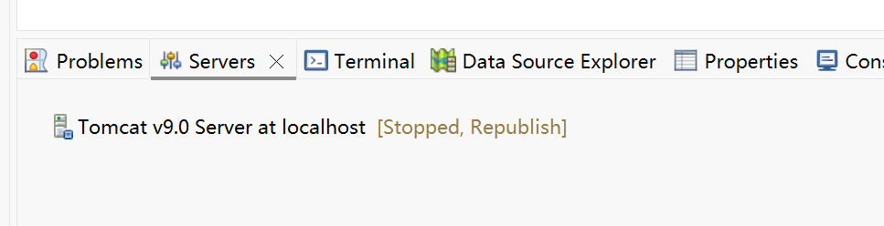
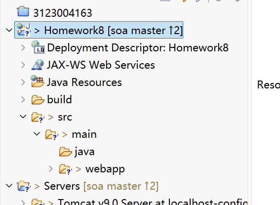
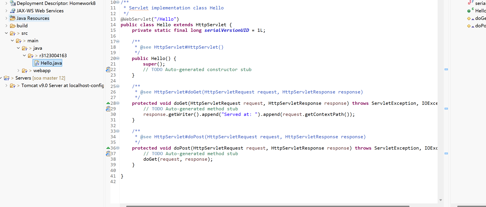
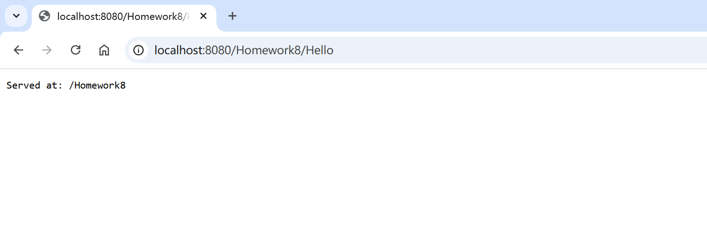
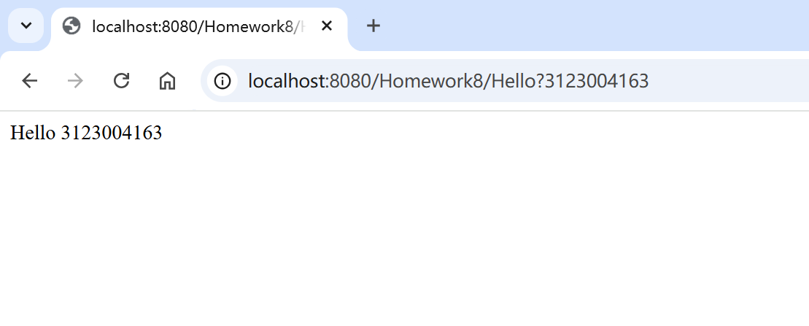
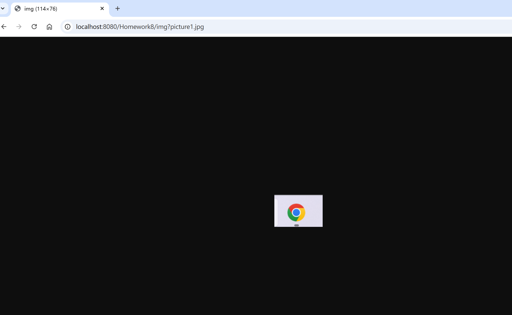

# 作业8：Servlet 与 Tomcat

## 基本信息

- **学号**：3123004163
- **姓名**：张逸壕
- **班级**：软件工程1班
- **作业名称**：SOA 第八次作业 — Servlet 编程
- **Eclipse 项目**：`Homework8`（部署后上下文路径一般为 `/Homework8`）
- **源码目录**：`eclipse-workspace/Homework8/src/main/java/r3123004163/`

## 作业要求

1. 修改 Hello Servlet：访问 `/Hello?学号` 时输出 `Hello 学号`
2. 新建图片 Servlet：访问 `/img?文件名` 时在浏览器显示 `webapp` 目录下的图片
3. 说明 `@WebServlet` 注解的含义
4. 截图运行结果，写成 Markdown 文档（本文件）
5. 修改前面作业中出现的错误或不足之处

## 实现说明

### 1. Hello Servlet（`Hello.java`）

- **映射**：`@WebServlet("/Hello")`
- **逻辑**：用 `request.getQueryString()` 读取 `?` 后的内容（课件示例为无名参数，不是 `name=value` 形式）
- **测试 URL**：`http://localhost:8080/Homework8/Hello?3123004163`
- **预期输出**：`Hello 3123004163`

### 2. 图片 Servlet（`ImgServlet.java`）

- **映射**：`@WebServlet("/img")`
- **图片位置**：`src/main/webapp/`（已放置 `picture1.jpg`、`picture2.jpg`、`picture3.jpg`）
- **逻辑**：
  1. `getQueryString()` 得到文件名
  2. `ServletContext.getResourceAsStream("/" + filename)` 读取 webapp 根目录文件
  3. `getMimeType()` 设置 `Content-Type`
  4. 将字节流写入 `response.getOutputStream()`
- **测试 URL**：
  - `http://localhost:8080/Homework8/img?picture1.jpg`
  - `http://localhost:8080/Homework8/img?picture2.jpg`
  - `http://localhost:8080/Homework8/img?picture3.jpg`


## `@WebServlet` 注解说明

`@WebServlet` 是 Servlet 3.0 引入的注解，写在 Servlet 类上，用于**声明这是一个 Servlet 并配置 URL 映射**，从而不必在 `WEB-INF/web.xml` 里手写 `<servlet>` 和 `<servlet-mapping>`。

常用属性：

| 属性 | 含义 | 本作业示例 |
|------|------|------------|
| `value` / `urlPatterns` | URL 路径模式 | `"/Hello"`、`"/img"` |
| `name` | Servlet 名称（可选） | 默认类名 |
| `loadOnStartup` | 启动时加载顺序 | 未使用 |

例如 `@WebServlet("/Hello")` 表示：当浏览器请求 `上下文路径/Hello` 时，由该类的 `doGet` / `doPost` 处理。Tomcat 启动时会扫描带注解的类并完成注册。

## 实验步骤与运行截图

### 第 1 步：安装并配置 Tomcat

在 Eclipse 中配置 Tomcat 9 运行环境，确认安装成功：



---

### 第 2 步：创建动态 Web 项目

新建 **Dynamic Web Project**，项目名 `Homework8`：



---

### 第 3 步：初始化 Server 并部署项目

在 **Servers** 视图中新建 Tomcat 实例，将 `Homework8` 添加到服务器：



启动 Tomcat 后，浏览器首次访问默认欢迎页，说明部署成功：



---

### 第 4 步：创建 Servlet

在项目中新建两个 Servlet 类（本仓库对应 `Hello.java` 与 `ImgServlet.java`）：


---

### 第 5 步：验证 Hello Servlet

浏览器访问：

```text
http://localhost:8080/Homework8/Hello?3123004163
```

页面应显示 `Hello 3123004163`：



| 项目 | 内容 |
|------|------|
| URL | `/Homework8/Hello?3123004163` |
| 预期 | 页面文字：`Hello 3123004163` |
| 实现 | `Hello.java` 中 `getQueryString()` 读取 `?` 后学号 |

---

### 第 6 步：验证图片 Servlet

浏览器访问（`webapp` 根目录下已有 `picture1.jpg` 等文件）：

```text
http://localhost:8080/Homework8/img?picture1.jpg
```

浏览器应直接显示对应 JPEG 图片：



| 项目 | 内容 |
|------|------|
| URL | `/Homework8/img?picture1.jpg` |
| 预期 | 浏览器内嵌显示图片 |
| 实现 | `ImgServlet.java` 读取 webapp 文件并写入 `OutputStream` |

亦可测试 `picture2.jpg`、`picture3.jpg`。
