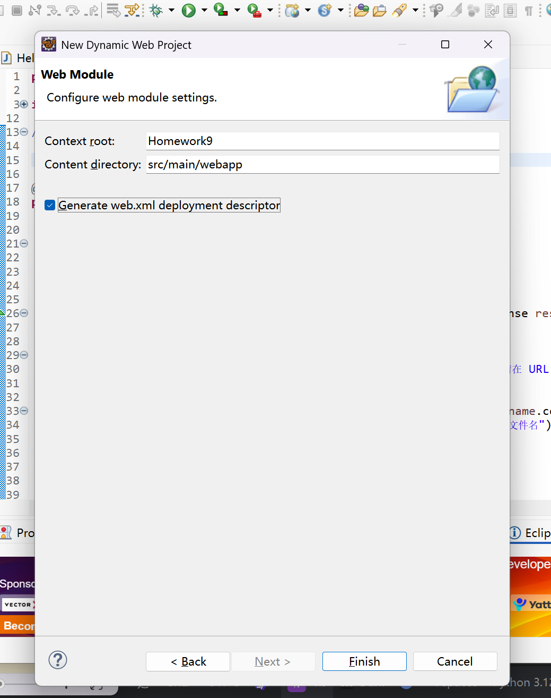
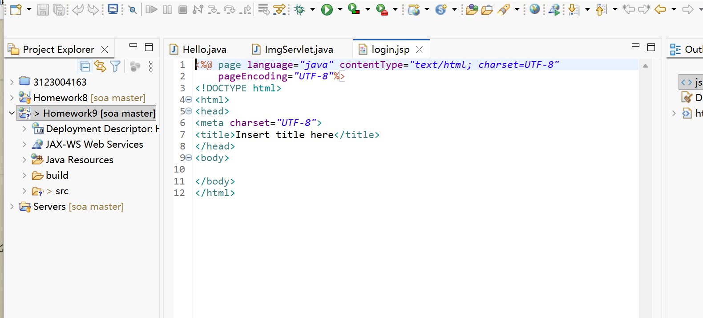
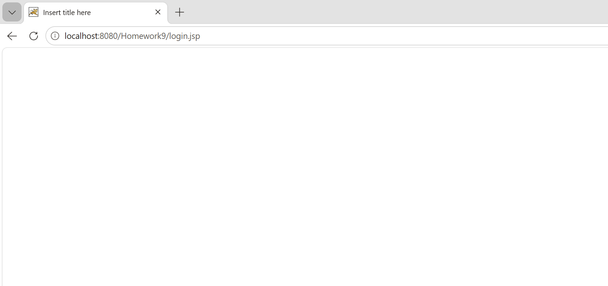
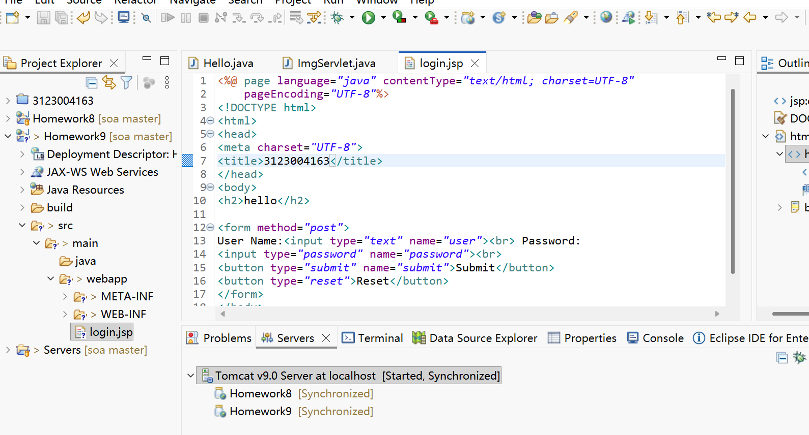
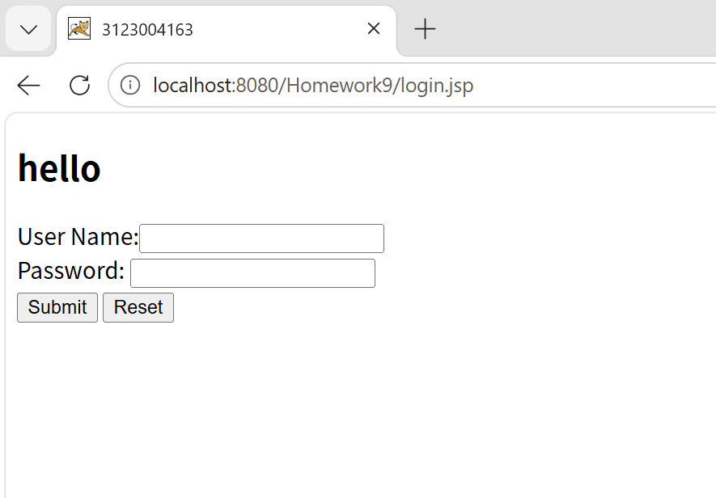
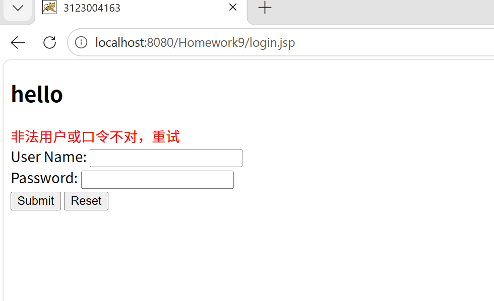
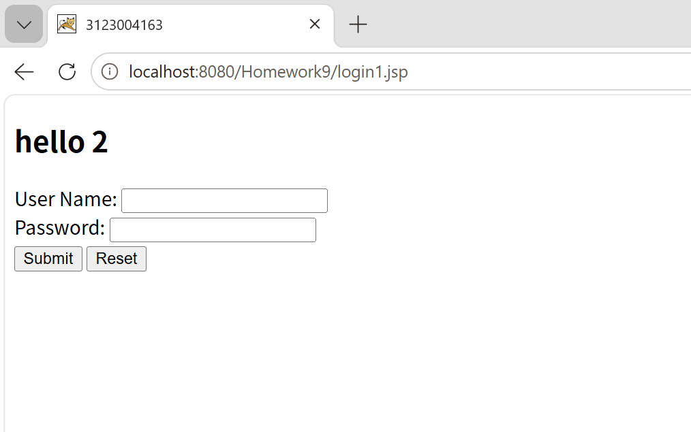
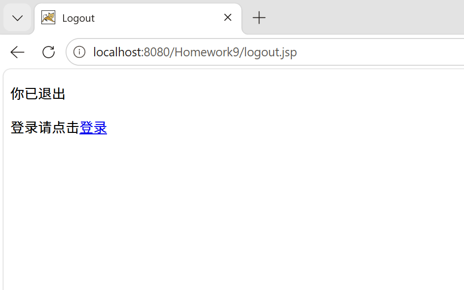
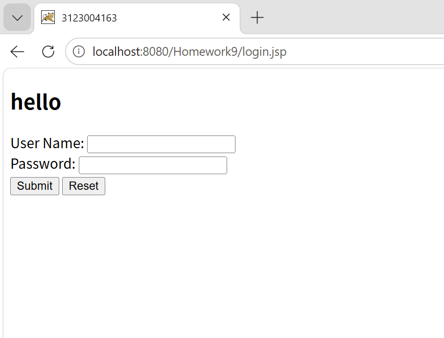

# 作业9：JSP 与 JavaBean

## 基本信息

- **学号**：3123004163
- **姓名**：张逸壕
- **班级**：软件工程1班
- **作业名称**：SOA 第九次作业 — JSP 与 JavaBean
- **Eclipse 项目**：`Homework9`（部署后上下文路径一般为 `/Homework9`）
- **源码目录**：
  - JSP：`eclipse-workspace/Homework9/src/main/webapp/`
  - JavaBean：`eclipse-workspace/Homework9/src/main/java/r3123004163/LoginBean.java`

## 作业要求

1. 在 JSP 中使用内嵌 Java 代码实现登录逻辑（`login.jsp`）
2. 创建用户登录 JavaBean（`LoginBean.java`）
3. 在 JSP 中使用 JavaBean 实现登录逻辑（`login1.jsp`）
4. 创建 `logout.jsp` 实现退出登录
5. 创建 `test.jsp` 判断登录状态，未登录时跳转到登录页
6. 撰写 Markdown 文档（本文件），包含截图与原理说明

## JSP 基本知识总结

JSP（JavaServer Pages）是在 HTML 中嵌入 Java 代码的动态网页技术，由 Web 容器（如 Tomcat）编译为 Servlet 后执行。常用元素包括：

| 元素 | 作用 |
|------|------|
| `<% ... %>` | 脚本片段，编写 Java 逻辑 |
| `<%= ... %>` | 表达式，输出结果到页面 |
| `<%@ page ... %>` | 页面指令，设置编码、导入包等 |
| `<jsp:useBean>` | 创建或获取 JavaBean 实例 |
| `<jsp:setProperty>` | 为 JavaBean 属性赋值 |
| `request` | 封装 HTTP 请求，读取表单参数 |
| `response` | 封装 HTTP 响应，可重定向 |
| `session` | 会话对象，保存登录状态 |

JavaBean 是一种符合规范的 Java 类：有无参构造、属性私有、提供 getter/setter，便于在 JSP 中复用业务逻辑。

## 各 JSP 文件原理说明

### 1. `index.jsp` — 导航页

提供到各登录页和测试页的链接，便于在浏览器中切换不同功能页面。

- **测试 URL**：`http://localhost:8080/Homework9/`

### 2. `login.jsp` — 内嵌 Java 登录

**原理**：在 JSP 脚本中直接编写 Java 代码，判断是否为 POST 提交，读取 `user`、`password` 参数，与固定账号 `3123004163/12345` 比较。成功则将用户名写入 `session`，失败则设置错误信息并在页面显示。

- **测试 URL**：`http://localhost:8080/Homework9/login.jsp`
- **测试账号**：`3123004163` / `12345`

### 3. `LoginBean.java` — 登录 JavaBean

**原理**：封装用户名、密码属性及 `isValidUser()` 方法，将校验逻辑从 JSP 页面分离。JSP 通过 `<jsp:useBean>` 和 `<jsp:setProperty property="*"/>` 自动把表单字段映射到 Bean 属性。

- **测试账号**：`3123004163` / `1234`（与 `login.jsp` 口令不同，与示例项目一致）

### 4. `login1.jsp` — 使用 JavaBean 登录

**原理**：POST 提交时用 `<jsp:useBean>` 创建 `LoginBean`，`<jsp:setProperty property="*"/>` 批量注入表单参数，再调用 `isValidUser()` 判断。成功则写入 session 并输出欢迎信息。

- **测试 URL**：`http://localhost:8080/Homework9/login1.jsp`
- **测试账号**：`3123004163` / `1234`

### 5. `login2.jsp` — 带重定向的 JavaBean 登录

**原理**：在 `login1.jsp` 基础上，登录成功后检查 session 中是否保存了原始访问 URL（`orign`）。若有则重定向回原页面，否则跳转到 `index.jsp`。配合 `test.jsp` 的未登录跳转使用。

- **测试 URL**：`http://localhost:8080/Homework9/login2.jsp`
- **测试账号**：`3123004163` / `1234`

### 6. `logout.jsp` — 退出登录

**原理**：调用 `session.invalidate()` 销毁当前会话，清除登录状态，并提示用户重新登录。

- **测试 URL**：`http://localhost:8080/Homework9/logout.jsp`

### 7. `test.jsp` — 登录状态检查

**原理**：访问时检查 `session.getAttribute("user")` 是否为 null。未登录则保存当前 URL 到 session 的 `orign` 属性，并用 `response.sendRedirect("login.jsp")` 跳转；已登录则显示欢迎信息和退出链接。页面 meta 标签禁止缓存，避免浏览器返回已退出页面。

- **测试 URL**：`http://localhost:8080/Homework9/test.jsp`

## 实验步骤与运行截图

### 第 1 步：创建动态 Web 项目

在 Eclipse 中新建 **Dynamic Web Project**，项目名 `Homework9`，并配置 Tomcat 9 运行环境：

---

### 第 2 步：创建 login.jsp

在 `src/main/webapp` 下新建 `login.jsp`，编写基本 HTML 表单结构：

首次部署后访问 `http://localhost:8080/Homework9/login.jsp`，页面标题为默认的 `Insert title here`，正文为空，说明 JSP 已能正常访问：

---

### 第 3 步：完善 login.jsp 表单并运行

补充页面标题（学号 `3123004163`）、`<h2>hello</h2>` 及用户名、密码输入框，再次运行后页面显示登录表单：

| 项目 | 内容 |
|------|------|
| URL | `http://localhost:8080/Homework9/login.jsp` |
| 预期 | 显示 `hello` 标题及 User Name / Password 表单 |

---

### 第 4 步：在 login.jsp 中加入内嵌 Java 逻辑判断

在 JSP 脚本片段中增加 POST 提交判断、用户名口令校验及错误提示逻辑。输入错误账号时，页面以红色文字显示「非法用户或口令不对，重试」：

| 项目 | 内容 |
|------|------|
| URL | `http://localhost:8080/Homework9/login.jsp` |
| 测试账号 | `3123004163` / `12345` |
| 成功 | 页面输出 `welcome 3123004163!`，并将用户名写入 session |
| 失败 | 红色提示「非法用户或口令不对，重试」 |

---

### 第 5 步：创建 LoginBean 并在 login1.jsp 中使用

新建 `LoginBean.java`（包名 `r3123004163`），封装 `user`、`password` 属性及 `isValidUser()` 方法；在 `login1.jsp` 中通过 `<jsp:useBean>` 和 `<jsp:setProperty property="*"/>` 注入表单参数并调用 Bean 完成校验。

浏览器访问 `login1.jsp`，页面显示 `hello 2` 及登录表单：

| 项目 | 内容 |
|------|------|
| URL | `http://localhost:8080/Homework9/login1.jsp` |
| 测试账号 | `3123004163` / `1234` |
| 成功 | 页面输出 `welcome 3123004163!`，并将用户名写入 session |
| 失败 | 红色提示「非法用户或口令不对，重试」 |

---

### 第 6 步：实现 logout.jsp 退出登录

`logout.jsp` 调用 `session.invalidate()` 销毁当前会话，并提示用户重新登录：

| 项目 | 内容 |
|------|------|
| URL | `http://localhost:8080/Homework9/logout.jsp` |
| 预期 | 显示「你已退出」，并提供返回登录页的链接 |

---

### 第 7 步：test.jsp 登录状态检查与跳转

访问 `test.jsp` 时，若 session 中无 `user` 属性，则保存当前 URL 到 `orign` 并 `sendRedirect` 到 `login.jsp`。未登录状态下访问 `test.jsp` 的效果如下（浏览器地址栏变为 `login.jsp`）：

| 项目 | 内容 |
|------|------|
| URL | `http://localhost:8080/Homework9/test.jsp` |
| 未登录 | 自动跳转到 `login.jsp` |
| 已登录 | 显示 `Welcome: 3123004163` 及「退出」链接 |

---

## 测试账号汇总

| 页面 | 用户名 | 密码 |
|------|--------|------|
| `login.jsp` | 3123004163 | 12345 |
| `login1.jsp` / `login2.jsp` | 3123004163 | 1234 |
